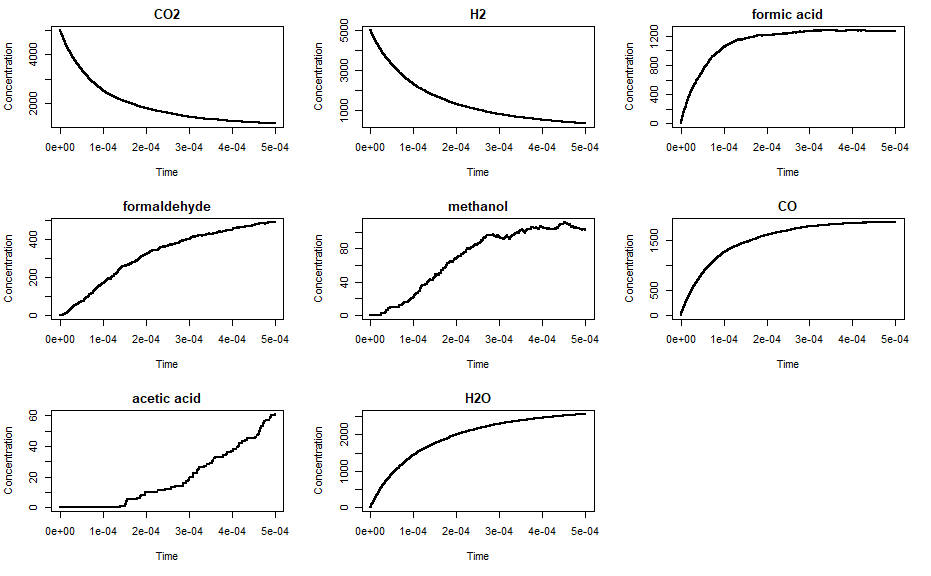
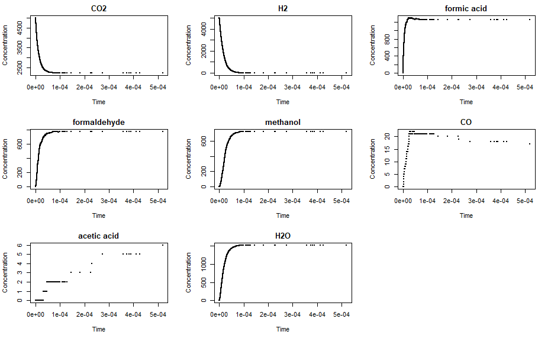
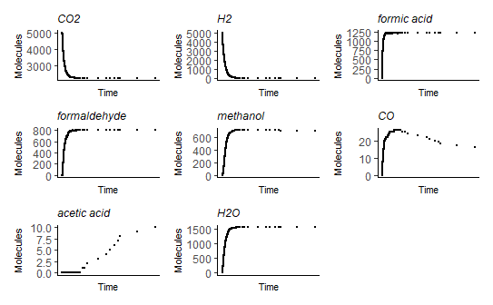
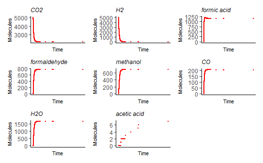

---
output:
  pdf_document: default
---


```{r setup, warning=FALSE, include=FALSE}
knitr::opts_chunk$set(echo = FALSE, message = FALSE, warning = FALSE, out.extra = "")
library("GillespieSSA")
library("ggplot2")
library("patchwork")
library("stringr")
# SOURCE .RDATA FILE of Lias matrices (.csv)
load(file = "lia_matrices.RData")
source(file = "C:/Users/sedar/Documents/Seda_Radoykova/UCL/1_BIOL0044 Th_Yr_Pr/stochastic_simulations/dependencies/plt_fnc.R") # plotting function
getwd()
```

```{r out.width="20%"}
#knitr::include_graphics("CO2_fixation_diagram.png")
```

# Reversible reaction simulation for simple carbon fixation

My aim was to introduce reversible reactions to the code written by the summer student. Previous attempts to encode reversible reactions seemed to lead to crashes. The results below indicate that the simulation  works in principle and that the reversibility of the reactions _per se_ does not cause a crash. <br> <br>
The simulations of forward reactions (in black) yield plots very similar to simulations of reversible reactions with negligibly small backward reaction rates (in red). The plots below show that when the backward reaction is $10^2$ times slower than its forward counterpart, slight differences in the simulation results could be observed, particularly for $CO$ and acetic acid. When the rate of the forward reaction was $10^3$ times greater than the backward reaction rate, there was virtually no difference between the unidirectional and reversible simulations. <br> <br>
However, when forward and backward reaction rates are equal (in blue), the simulation is truncated early and an error message is displayed, `negative propensity function - coersing to zero`. In other words, we sometimes observe negative values _e.g._ for formaldehyde, methanol, $CO$, acetate, $H_2O$. In some simulations, the number of $CO_2$ and $H_2$ molecules surpses the initial input values. This could be caused both by the low numbers of chemical species and by the fact that certain reactants are depleted (and/or replenished) by multiple reactions. Possible solutions would include adjusting the time-step or the relative magnitude of the forward and backward reaction rates to push the system away from chemical equilibrium. <br> <br>
_Note that not all features described here might be seen in the plots below, as every simulation yields slightly different resuls._ <br><br>

## Reactions, Parameters, and Conditions

The reactions and parameters used in the simulations are summarised below: 

| Forward reactions | Parameters |
|-------------------|------------|
| $k_{1}*CO_{2}*H_{2}$ | $k_{1} = 10$ |
| $k_{2}*formic\ acid*H_{2}$ | $k_{2} = 19.9$ |
| $k_{3}*formaldehyde*H_{2}$ | $k_{3} = 23.5$ |
| $k_{4}*methanol*CO$ | $k_{4} = 0.869$ |
| $k_{5}*CO_{2}*H_{2}$ | $k_{5} = 0.061$ |

Conditions kept constant across simulations: 

* initial reactants numbers: $CO_{2} = H_{2} = 5000\ molecules$
* timestep size: tf = $0.0005$ 
<br> <br>


``` {r carbon fixation new, warning=FALSE, echo=FALSE}
#### BLACK Forward reactions (Lia's simulation)
# no_cofactors

parms_k <- c(
  k_1 = 10,
  k_2 = 19.9,
  k_3 = 23.5,
  k_4 = 0.869,
  k_5 = 0.061
) 
nmol <- 5000

#initial concentrations of reactants and products involved 
x_c_fix <- c(CO2 = nmol, H2 = nmol, formic_acid = 0,
        formaldehyde = 0, methanol = 0, CO = 0, acetic_acid = 0, H2O = 0) 

a_c_fix <- #carbon fixation
  c(
    "k_1*CO2*H2",
    "k_2*formic_acid*H2",
    "k_3*formaldehyde*H2",
    "k_4*methanol*CO",
    "k_5*CO2*H2"
  )

# state change matrix

mat_c_fix <- as.matrix(csvs_matrices$no_cofactors[,2:6])

out_c_fix <- ssa(x0 = x_c_fix, a = a_c_fix, 
                      nu = mat_c_fix, parms = parms_k, 
                      tf = 0.0005, method = ssa.d())

# cat("Why is the sum of the matrix =", sum(mat_co_fix_new), "???")
#cat("Output dim =", dim(out_co_fix_new$data))

fwd = plt_fnc(
  to_plot = colnames(out_c_fix[["data"]])[-1], 
  data = out_c_fix[["data"]], col = "black"
  )
#for (i in 1:16) cat("p1[[", i, "]] + ", sep = "")
#fwd[[1]] + fwd[[2]] + fwd[[3]] + fwd[[4]] + fwd[[5]] + fwd[[6]] + fwd[[7]] + fwd[[8]]
```


```{r}
# initial concentrations of reactants and products involved 
nmol <- 5000

x_rev_c_fix <- c(
    CO2 = nmol,
    H2 = nmol,
    formic_acid = 0,
    formaldehyde = 0,
    methanol = 0,
    CO = 0,
    acetic_acid = 0,
    H2O = 0) 

a_rev_c_fix <- c( # carbon fixation
                  "k_1*CO2*H2",
                  "k_1a*CO2*H2",
                  "k_2*formic_acid*H2",
                  "k_2a*formic_acid*H2",
                  "k_3*formaldehyde*H2",
                  "k_3a*formaldehyde*H2",
                  "k_4*methanol*CO",
                  "k_4a*methanol*CO",
                  "k_5*CO2*H2",
                  "k_5a*CO2*H2")

# state change matrix
mat_rev_c_fix <- as.matrix(read.csv("reversible_c_fix.csv", header = F)[-1])
```


```{r}
#### RED Reversible reactions - negligible backward rates

# parameters
parms_k <- c(k_1 = 10, k_1a = 0.001, 
             k_2 = 19.9, k_2a = 0.0199, 
             k_3 = 23.5, k_3a = 0.0235, 
             k_4 = 0.869, k_4a = 0.000869, 
             k_5 = 0.061, k_5a = 0.000061)

#output
out_rev_c_fix <- ssa(x0 = x_rev_c_fix, 
                      a = a_rev_c_fix, 
                      nu = mat_rev_c_fix,
                      parms = parms_k, 
                      tf = 0.0005, verbose = F)
#cat("Output dim =", dim(out_rev_c_fix$data))

rev_negl = plt_fnc(
  to_plot = colnames(out_rev_c_fix[["data"]])[-1], 
  data = out_rev_c_fix[["data"]], col = "red"
  )
#for (i in 1:16) cat("p1[[", i, "]] + ", sep = "")
#rev_negl[[1]] + rev_negl[[2]] + rev_negl[[3]] + rev_negl[[4]] + rev_negl[[5]] + rev_negl[[6]] + rev_negl[[7]] + rev_negl[[8]]
```


```{r}
#### BLUE Reversible reactions - equal forward/backward rates

# parameters
parms_k <- c(k_1 = 10, k_1a = 10, 
             k_2 = 19.9, k_2a = 19.9, 
             k_3 = 23.5, k_3a = 23.5, 
             k_4 = 0.869, k_4a = 0.869, 
             k_5 = 0.061, k_5a = 0.061)

x_rev_c_fix_eq = x_rev_c_fix

a_rev_c_fix_eq = a_rev_c_fix

#output
out_rev_c_fix <- ssa(x0 = x_rev_c_fix_eq, 
                      a = a_rev_c_fix_eq, 
                      nu = mat_rev_c_fix,
                      parms = parms_k, 
                      tf = 0.0005, verbose = F)
#cat("Output dim =", dim(out_rev_c_fix$data))

rev_eq = plt_fnc(
  to_plot = colnames(out_rev_c_fix[["data"]])[-1], 
  data = out_rev_c_fix[["data"]], col = "blue"
  )
#for (i in 1:16) cat("p1[[", i, "]] + ", sep = "")
#rev_eq[[1]] + rev_eq[[2]] + rev_eq[[3]] + rev_eq[[4]] + rev_eq[[5]] + rev_eq[[6]] + rev_eq[[7]] + rev_eq[[8]]
```


#### BLACK Forward reactions (Lia's simulation)
#### RED Reversible reactions - negligible backward rates
#### BLUE Reversible reactions - equal forward/backward rates

\newpage

```{r fig.height=3.5, fig.cap="BLACK Forward reactions (Lia's simulation)"}
#for (i in 1:8) cat("fwd[[", i, "]] + ","rev_negl[[", i, "]] + ", "rev_eq[[", i, "]] + ", sep = "")
fwd[[1]] + rev_negl[[1]] + rev_eq[[1]] + fwd[[2]] + rev_negl[[2]] + rev_eq[[2]]
```

```{r fig.height=3.5, fig.cap="RED Reversible reactions - negligible backward rates"}
fwd[[3]] + rev_negl[[3]] + rev_eq[[3]] + fwd[[4]] + rev_negl[[4]] + rev_eq[[4]]
```

```{r fig.height=3.5, fig.cap="BLUE Reversible reactions - equal forward/backward rates"}
fwd[[5]] + rev_negl[[5]] + rev_eq[[5]] + fwd[[6]] + rev_negl[[6]] + rev_eq[[6]]
```

```{r fig.height=3.5}
fwd[[7]] + rev_negl[[7]] + rev_eq[[7]] + fwd[[8]] + rev_negl[[8]] + rev_eq[[8]]
```


\newpage 

Additionally, I recoded the state-change matrices from scratch in order to make sure that the code was bug-free. (In the process I wrote a couple of functions which should make it easier to model bigger networks, using the excel files which Stuart supplies as an input.) The to compare, the simulations yield the following results. 

```{r fig.cap="Lia's original simulation. It is strange because the chunk in the github files ran a simulation without k values in the chemical equations. It also had a reaction which replenished formic acid."}

```

```{r fig.cap="This simulation still had the replenishing formic acid reaction but it also had k values for the reactions."}

```

```{r fig.cap="I removed the sixth reaction and ran the same simulation as above."}

```

```{r fig.cap="Recoding all parameters, equations, and the state-change matrix, I got the following results."}

```

