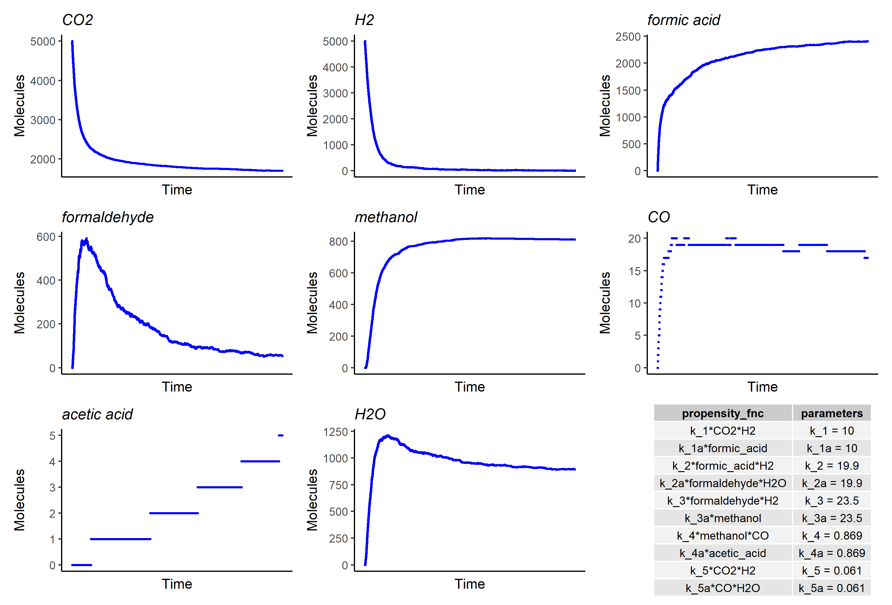

---
output:
  pdf_document: default
---

```{r setup, warning=FALSE, include=FALSE}
knitr::opts_chunk$set(echo = FALSE, message = FALSE, warning = FALSE, out.extra = "")
library("GillespieSSA")
library("ggplot2")
library("patchwork")
library("ggpmisc")
library("stringr")
# SOURCE .RDATA FILE of Lias matrices (.csv)
load(file = "data/lia_matrices.RData")
source(file = "../dependencies/plt_fnc.R") # plotting function
```

# Comparing simulations of irreversible and reversible $CO_{2}$ fixation reactions (simplified $CO_{2}$ fixation)

The output on the next page is generated after manually tweaking Lia's CO2 fixation simulation from the summer. The original simulation is the irreversible CO2 fixation network (output in **black**). In **\textcolor{red}{red}**, reversible reactions with negligible backward rates yield simulations which are very similar to the irreversible reaction simulations. In **\textcolor{blue}{blue}**, the reversible reactions with equal forward and backward reaction rates result in a distinct trajectory. \bigskip

| Forward reactants | Forward products | Propensity function | Parameters |
|-------------------|-------------------|-------------------|------------|
| $CO_{2},\ H_{2}$ | $formic\ acid$ | $k_{1}*CO_{2}*H_{2}$ | $k_{1} = 10$ |
| $formic\ acid,\ H_{2}$ | $formaldehyde,\ H_{2}O$ | $k_{2}*formic\ acid*H_{2}$ | $k_{2} = 19.9$ |
| $formaldehyde,\ H_{2}$ | $methanol$ | $k_{3}*formaldehyde*H_{2}$ | $k_{3} = 23.5$ |
| $methanol,\ CO$| $acetic\ acid$ | $k_{4}*methanol*CO$ | $k_{4} = 0.869$ |
| $CO_{2},\ H_{2}$ | $CO,\ H_{2}O$ | $k_{5}*CO_{2}*H_{2}$ | $k_{5} = 0.061$ |


\newpage

``` {r carbon fixation new, warning=FALSE, echo=FALSE}
#### BLACK Forward reactions (Lia's simulation)
# no_cofactors

parms_k <- c(
  k_1 = 10,
  k_2 = 19.9,
  k_3 = 23.5,
  k_4 = 0.869,
  k_5 = 0.061
) 
nmol <- 5000

#initial concentrations of reactants and products involved 
x_c_fix <- c(CO2 = nmol, H2 = nmol, formic_acid = 0,
        formaldehyde = 0, methanol = 0, CO = 0, acetic_acid = 0, H2O = 0) 

a_c_fix <- #carbon fixation
  c(
    "k_1*CO2*H2",
    "k_2*formic_acid*H2",
    "k_3*formaldehyde*H2",
    "k_4*methanol*CO",
    "k_5*CO2*H2"
  )

# state change matrix

mat_c_fix <- as.matrix(csvs_matrices$no_cofactors[,2:6])

out_c_fix <- ssa(x0 = x_c_fix, a = a_c_fix, 
                      nu = mat_c_fix, parms = parms_k, 
                      tf = 0.0005, method = ssa.d())

# cat("Why is the sum of the matrix =", sum(mat_co_fix_new), "???")
#cat("Output dim =", dim(out_co_fix_new$data))

fwd = plt_fnc(
  to_plot = colnames(out_c_fix[["data"]])[-1], 
  data = out_c_fix[["data"]], col = "black"
  )
#for (i in 1:16) cat("p1[[", i, "]] + ", sep = "")
fig = fwd[[1]] + fwd[[2]] + fwd[[3]] + fwd[[4]] + fwd[[5]] + fwd[[6]] + fwd[[7]] + fwd[[8]]
```


```{r}
# table = data.frame(propensity_fnc = out_c_fix$args$a,
#                    parameters = str_c(names(out_c_fix$args$parms),
#                                       " = ",
#                                       out_c_fix$args$parms))
# ggsave(fig + (ggplot() + theme_void()) +
#          annotate(geom = "table", x = 5, y = 2,
#                   label = list(table), vjust = 0.45, hjust = 0.55),
#        file = paste0("images/lia_sim_tab.png"), width = 20, height = 15, units = "cm")
```


```{r}
# initial concentrations of reactants and products involved 
nmol <- 5000

x_rev_c_fix <- c(
    CO2 = nmol,
    H2 = nmol,
    formic_acid = 0,
    formaldehyde = 0,
    methanol = 0,
    CO = 0,
    acetic_acid = 0,
    H2O = 0) 

a_rev_c_fix <- c( # carbon fixation
                  "k_1*CO2*H2",
                  "k_1a*formic_acid",
                  "k_2*formic_acid*H2",
                  "k_2a*formaldehyde*H2O",
                  "k_3*formaldehyde*H2",
                  "k_3a*methanol",
                  "k_4*methanol*CO",
                  "k_4a*acetic_acid",
                  "k_5*CO2*H2",
                  "k_5a*CO*H2O")

# state change matrix
mat_rev_c_fix <- as.matrix(read.csv("data/reversible_c_fix.csv", header = F)[-1])
```


```{r}
#### RED Reversible reactions - negligible backward rates

# parameters
parms_k <- c(k_1 = 10, k_1a = 0.001, 
             k_2 = 19.9, k_2a = 0.0199, 
             k_3 = 23.5, k_3a = 0.0235, 
             k_4 = 0.869, k_4a = 0.000869, 
             k_5 = 0.061, k_5a = 0.000061)

#output
out_rev_c_fix <- ssa(x0 = x_rev_c_fix, 
                      a = a_rev_c_fix, 
                      nu = mat_rev_c_fix,
                      parms = parms_k, 
                      tf = 0.0005, verbose = F, ignoreNegativeState = F)
#cat("Output dim =", dim(out_rev_c_fix$data))

rev_negl = plt_fnc(
  to_plot = colnames(out_rev_c_fix[["data"]])[-1], 
  data = out_rev_c_fix[["data"]], col = "red"
  )
#for (i in 1:16) cat("p1[[", i, "]] + ", sep = "")
fig = rev_negl[[1]] + rev_negl[[2]] + rev_negl[[3]] + rev_negl[[4]] + rev_negl[[5]] + rev_negl[[6]] + rev_negl[[7]] + rev_negl[[8]]
```

```{r}
# table = data.frame(propensity_fnc = out_rev_c_fix$args$a,
#                    parameters = str_c(names(out_rev_c_fix$args$parms),
#                                       " = ",
#                                       out_rev_c_fix$args$parms))
# ggsave(fig + (ggplot() + theme_void()) +
#          annotate(geom = "table", x = 10, y = 2,
#                   label = list(table), vjust = 0.47, hjust = 0.5),
#        file = paste0("images/rev_sim_neg.png"), width = 25, height = 17, units = "cm")
```


```{r}
#### BLUE Reversible reactions - equal forward/backward rates

# parameters
parms_k <- c(k_1 = 10, k_1a = 10, 
             k_2 = 19.9, k_2a = 19.9, 
             k_3 = 23.5, k_3a = 23.5, 
             k_4 = 0.869, k_4a = 0.869, 
             k_5 = 0.061, k_5a = 0.061)

x_rev_c_fix_eq = x_rev_c_fix

a_rev_c_fix_eq = a_rev_c_fix

#output
out_rev_c_fix <- ssa(x0 = x_rev_c_fix_eq,
                     a = a_rev_c_fix_eq, 
                     nu = mat_rev_c_fix,
                     parms = parms_k,
                     tf = 0.0005, 
                     ignoreNegativeState = F, 
                     method = ssa.d(),
                     verbose = F, 
                     consoleInterval = 0.000001)
#cat("Output dim =", dim(out_rev_c_fix$data))

rev_eq = plt_fnc(
  to_plot = colnames(out_rev_c_fix[["data"]])[-1], 
  data = out_rev_c_fix[["data"]], col = "blue"
  )
#for (i in 1:16) cat("p1[[", i, "]] + ", sep = "")
fig = rev_eq[[1]] + rev_eq[[2]] + rev_eq[[3]] + rev_eq[[4]] + rev_eq[[5]] + rev_eq[[6]] + rev_eq[[7]] + rev_eq[[8]]
```

```{r}
# table = data.frame(propensity_fnc = out_rev_c_fix$args$a,
#                    parameters = str_c(names(out_rev_c_fix$args$parms),
#                                       " = ",
#                                       out_rev_c_fix$args$parms))
# ggsave(fig + (ggplot() + theme_void()) +
#          annotate(geom = "table", x = 10, y = 2,
#                   label = list(table), vjust = 0.50, hjust = 0.5),
#        file = paste0("images/rev_sim_works.png"), width = 25, height = 17, units = "cm")
# ggsave(fig,
#        file = paste0("images/rev_sim_works1.png"), width = 18, height = 13, units = "cm")
```


\newpage

```{r fig.height=3.5}
#for (i in 1:8) cat("fwd[[", i, "]] + ","rev_negl[[", i, "]] + ", "rev_eq[[", i, "]] + ", sep = "")
png(filename = "images/all_CO2_H2.png", 
    res = 160, units = "cm", width = 15, height = 10)
fwd[[1]] + rev_negl[[1]] + rev_eq[[1]] + fwd[[2]] + rev_negl[[2]] + rev_eq[[2]]
dev.off()
getwd()
```

```{r fig.height=3.5}
png(filename = "images/all_formate_formaldehyde.png", 
    res = 160, units = "cm", width = 15, height = 10)
fwd[[3]] + rev_negl[[3]] + rev_eq[[3]] + fwd[[4]] + rev_negl[[4]] + rev_eq[[4]]
dev.off()
```

```{r fig.height=3.5}
fwd[[5]] + rev_negl[[5]] + rev_eq[[5]] + fwd[[6]] + rev_negl[[6]] + rev_eq[[6]]
```

```{r fig.height=3.5}
png(filename = "images/all_acetate_H2O.png", 
    res = 160, units = "cm", width = 15, height = 10)
fwd[[7]] + rev_negl[[7]] + rev_eq[[7]] + fwd[[8]] + rev_negl[[8]] + rev_eq[[8]]
dev.off()
```

\newpage 

### Inspecting the reversible network

The network diagram below shows the relationship between the differrent reactants and products. 

```{r out.width="50%"}


```


```{r}
df = as.data.frame(out_rev_c_fix[["data"]]) 
# be careful, out_rev_c_fix is updated with every run of the reversible networks 
# so run the relevant one last!

all_react = ggplot(df, aes(x = t)) +
  geom_line(aes(y = CO2, colour = "CO2")) +
  geom_line(aes(y = H2, colour = "H2")) + 
  geom_line(aes(y = formic_acid, colour = "formic_acid")) +
  geom_line(aes(y = formaldehyde, colour = "formaldehyde")) +
  geom_line(aes(y = methanol, colour = "methanol")) +
  geom_line(aes(y = CO, colour = "CO")) +
  geom_line(aes(y = acetic_acid, colour = "acetic_acid")) +
  geom_line(aes(y = H2O, colour = "H2O")) + 
  theme_classic() +
  ylim(0, 2500) + 
  #ggtitle("Reversible C fixation") +
  xlab("Time") + ylab("Number of molecules") +
  theme(axis.text.x = element_blank(),
        axis.ticks = element_blank(), 
        legend.title = element_text(size = 5),
        legend.text = element_text(size = 5),
        legend.position = c(0.85,0.55),
        legend.direction = "vertical",
        legend.background = element_rect(fill = "gray95",
                                         size = 0.5, linetype = "solid")) +
  guides(colour = guide_legend(title = "Species",
                               override.aes = list(size = 0.3)))

ggsave((ggplot() +  theme_void() + 
         theme(plot.margin = margin(t = 0, r = 0, b = 0, l = 0))) +
         annotate(geom = "table", x = 10, y = 2,
                  label = list(table), vjust = 0.5, hjust = 0.5) +
         all_react,
       file = paste0("images/rev_sim_oneplot.png"), width = 20, height = 8, units = "cm")
```

```{r}
ggplot(df, aes(x = t)) +
  geom_line(aes(y = CO2, colour = "CO2")) +
  geom_line(aes(y = H2, colour = "H2")) + 
  geom_line(aes(y = formaldehyde, colour = "formaldehyde")) +
  geom_line(aes(y = methanol, colour = "methanol")) +
  geom_line(aes(y = CO, colour = "CO")) +
  geom_line(aes(y = acetic_acid, colour = "acetic_acid")) +
  theme_minimal() +
  ylim(0, 850) + 
  ggtitle("Reversible C fixation") +
  xlab("Time") + ylab("Number of molecules") +
  theme(axis.text.x = element_blank(),
        axis.ticks = element_blank(), 
        legend.position = c(0.85,0.6)) +
  guides(colour = guide_legend(title = "Species"))
```

```{r}
ggsave(fig + (ggplot() + theme_void()) +
         annotate(geom = "table", x = 10, y = 2,
                  label = list(table), vjust = 0.50, hjust = 0.5),
       file = paste0("images/rev_sim_works.png"), width = 25, height = 17, units = "cm")
```


\newpage 

### Compare to Lia's simulations 
```{r out.width="75%"}

```

```{r out.width="75%"}

```

```{r out.width="75%"}

```