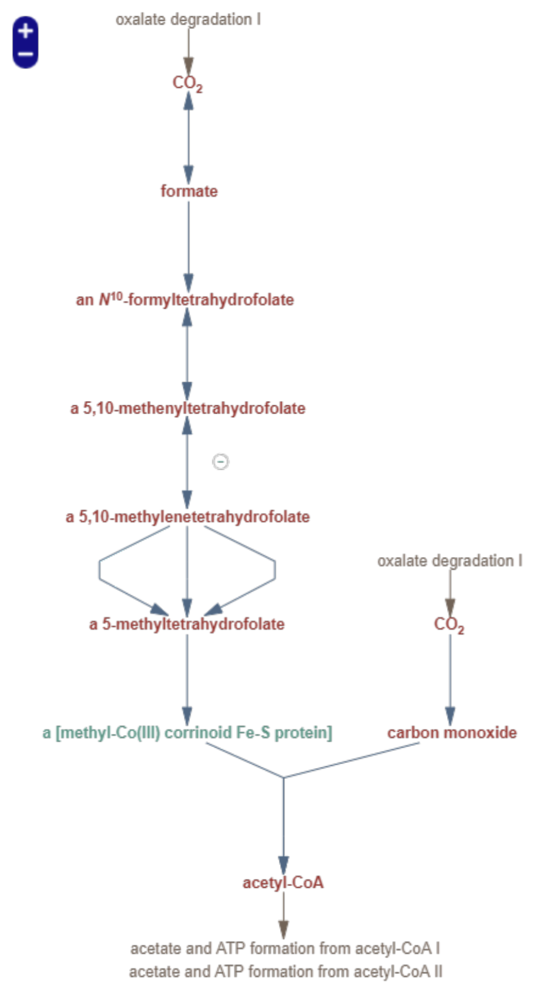

```{r setup, warning=FALSE}
knitr::opts_chunk$set(echo = FALSE, message = FALSE, warning = FALSE, fig.pos = "!H", out.extra = "")
library("GillespieSSA")
library("ggplot2")
library("patchwork")
library("stringr")
# SOURCE .RDATA FILE of Lias matrices (.csv)
load(file = "lia_matrices.RData")
source(file = "dependencies/plt_fnc.R") # plotting function
```

```{r out.width="20%"}
#
```

# Lia's working code

A simpler model was created without the need for cofactors, including all tetrahydrofolate intermediates. As such, different products were formed, and the results of this are seen below. CO~2~ is fixed to acetic acid. CO synthesis is less kinetically favorable, with a significantly lower rate constant, than methanol synthesis and all preceding steps. More methanol than CO is produced, in contrast to earlier models where CO synthesis was high. 

``` {r carbon fixation new, warning=FALSE, echo=FALSE}
# no_cofactors
# not sure which a_co_fix_new to be using 

parms_k <- c(k_1 = 10, k_2 = 19.9, k_3 = 23.5, k_4 = 0.869, k_5 = 0.061) 
nmol <- 5000

#initial concentrations of reactants and products involved 
x_co_fix_new <- c(CO2 = nmol, H2 = nmol, formic_acid = 0,
        formaldehyde = 0, methanol = 0, CO = 0, acetic_acid = 0, H2O = 0) 

a_co_fix_new <- #carbon fixation
  c(
    "k_1*CO2*H2",
    "k_2*formic_acid*H2",
    "k_3*formaldehyde*H2",
    "k_4*methanol*CO",
    "k_5*CO2*H2",
    "20*formic_acid"
  )

# a_co_fix_new <- #carbon fixation
#   c("CO2*H2",
#     "formic_acid*H2",
#     "formaldehyde*H2",
#     "methanol*CO",
#     "CO2*H2",
#     "formic_acid")

# state change matrix
mat_co_fix_new <- as.matrix(csvs_matrices$no_cofactors[,-1])
sum(mat_co_fix_new) ###### -1!1!!!!

out_co_fix_new <- ssa(x0 = x_co_fix_new, a = a_co_fix_new, 
                      nu = mat_co_fix_new, parms = parms_k, 
                      tf = 0.0005, method = ssa.d())
```


```{r}
# Make sure plt_fnc is sourced from 'plt_fnc.R'
p1 = plt_fnc(
  to_plot = c("CO2", "formic_acid", "CO", "acetic_acid"), 
  data = out_co_fix_new[["data"]]
  )

p1[[1]] + p1[[2]] + p1[[3]] + p1[[4]]
```


### Modifying Lia's code

```{r}
# no_cofactors
# uses the other a_co_fix_new chunk 

parms_k <- c(k_1 = 10, k_2 = 19.9, k_3 = 23.5, k_4 = 0.869, k_5 = 0.061) 
nmol <- 5000

#initial concentrations of reactants and products involved 
x_co_fix_new <- c(CO2 = nmol, H2 = nmol, formic_acid = 0,
                  formaldehyde = 0, methanol = 0, CO = 0, 
                  acetic_acid = 0, H2O = 0) 

# a_co_fix_new <- # carbon fixation 
  # c("k_1*CO2*H2", 
   #  "k_2*formic_acid*H2", 
    # "k_3*formaldehyde*H2", 
    # "k_4*methanol*CO", 
    # "k_5*CO2*H2",
    # "20*formic_acid")

a_co_fix_new <- # carbon fixation 
  c("CO2*H2", 
    "formic_acid*H2", 
    "formaldehyde*H2", 
    "methanol*CO", 
    "CO2*H2",
    "formic_acid")

# state change matrix
mat_co_fix_new <- as.matrix(csvs_matrices$no_cofactors[,-1])

out_co_fix_new <- ssa(x_co_fix_new, a_co_fix_new, 
                      mat_co_fix_new, parms_k, tf = 0.0005)
```

```{r}
source("dependencies/plt_fnc.R")
p1 = plt_fnc(
  to_plot = colnames(out_co_fix_new[["data"]])[-1], 
  data = out_co_fix_new[["data"]]
  )

p1[[1]] + p1[[2]] + p1[[3]] + p1[[4]] + p1[[5]] + p1[[6]] + p1[[7]] + p1[[8]]
```

## Things get dysfunctional here 

```{r}
parms_k <- c(k_1 = 10, #k_1a = 10, 
             k_2 = 19.9, #k_2a = 19.9, 
             k_3 = 23.5, #k_3 = 23.5, 
             k_4 = 0.869, #k_4a = 0.869, 
             k_5 = 0.061) #k_5a = 0.061) 
nmol <- 5000

# initial concentrations of reactants and products involved 
x_co_fix_new <- c(CO2 = nmol, CO2 = 0, H2 = nmol, H2 = 0, 
                  formic_acid = 0, formic_acid = 0,
                  formaldehyde = 0, formaldehyde = 0, 
                  methanol = 0, methanol = 0, CO = 0, CO = 0, 
                  acetic_acid = 0, acetic_acid = 0, H2O = 0, H2O = 0) 

# a_co_fix_new <- c(       # carbon fixation
#                   "k_1*CO2*H2", 
# #                  "k_1a*CO2*H2", 
#                   "k_2*formic_acid*H2",
# #                  "k_2a*formic_acid*H2",
#                   "k_3*formaldehyde*H2",
# #                  "k_3a*formaldehyde*H2",
#                   "k_4*methanol*CO",
# #                  "k_4a*methanol*CO",
#                   "k_5*CO2*H2",
# #                  "k_5a*CO2*H2",
#                   "20*formic_acid") 
# #                  "20*formic_acid")

a_co_fix_new <- # carbon fixation
  c("CO2*H2",
    "formic_acid*H2",
    "formaldehyde*H2",
    "methanol*CO",
    "CO2*H2",
    "formic_acid")

# state change matrix
mat_co_fix_new <- matrix(data = c(
-1,0,0,0,-1,0,
1,0,0,0,1,0,  
-1,-1,-1,0,-1,0,
1,1,1,0,1,0,
1,-1,0,0,0,0,
-1,1,0,0,0,0,
0,1,-1,0,0,0,
0,-1,1,0,0,0,
0,0,1,-1,0,0,
0,0,-1,1,0,0,
0,0,0,-1,1,0,
0,0,0,1,-1,0,
0,0,0,1,0,0,
0,0,0,-1,0,0,
0,1,0,0,1,0,
0,-1,0,0,-1,0), nrow = 16, ncol = 6, byrow = T)

out_co_fix_new <- ssa(x0 = x_co_fix_new, 
                      a = a_co_fix_new, 
                      nu = mat_co_fix_new,
                      parms = parms_k, 
                      tf = 0.000001, verbose = T)

sum(as.matrix(csvs_matrices$no_cofactors[-1]))
#print.data.frame(mat_co_fix_new1)
```

```{r}
p1 = plt_fnc(
  to_plot = colnames(out_co_fix_new[["data"]])[-1], 
  data = out_co_fix_new[["data"]],
  )
#for (i in 1:16) cat("p1[[", i, "]] + ", sep = "")
p1[[1]] + p1[[2]] + p1[[3]] + p1[[4]] + p1[[5]] + p1[[6]] + p1[[7]] + p1[[8]] + p1[[9]] + p1[[10]] + p1[[11]] + p1[[12]] + p1[[13]] + p1[[14]] + p1[[15]] + p1[[16]]
```

```{r}
data = out_co_fix_new[["data"]]
head(data)
#data[,2] + data[,3]
```


# Notes before my brain switches off completely
* When I decreased the time step by 2 orders of magnitude, things crashed at step 6 insteras of step 3 :) 

* I am not sure if the algo knows that the CO2 produced in reaction 1 is the same as the CO2 consumed in reaction 2... 
  * i.e. does it stop to sum the two CO2 columns and use the pooled CO2 for the next reaction? 
    * https://github.com/rcannood/GillespieSSA/blob/master/R/ssa.run.R
* If it doesn't 
  * Should we implement the algo from scratch? 
  * Should we only model forward reactions, making the probability of the forward reaction occuring a composite variable which captures the rates of the forwards and backwards reactiion? 


